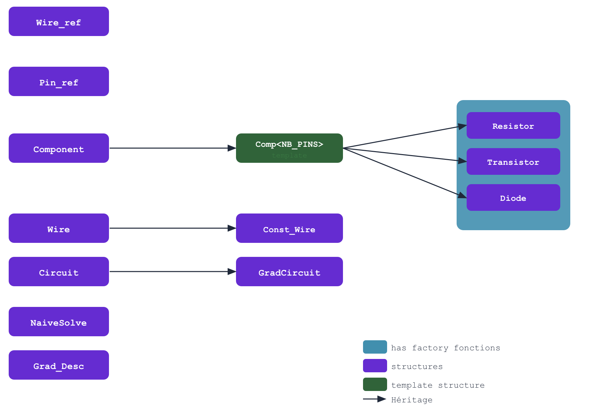

# Miléna - Portfolio

Welcome to my portfolio! I'm Miléna, an engineering student at CentraleSupélec, in France.

## 🛠️ Personal Projects

### [Analogic Circuit Simulator]

**Description**: A lightweight, extensible C++20 library for simulating the steady-state behavior of analog electronic circuits. The project models Kirchhoff's Current Law as an error function to be minimized, letting you solve circuits by finding the node potentials that satisfy the laws of physics. Includes built-in models for resistors, diodes (Shockley), and transistors (Ebers-Moll).
**Programming language**: C++ 20

**Links**: [View Repository](https://github.com/milenacdg/analogic_circuit_simulator)

---

### [Project Name 2]
**Description**: ...  
**Technologies**: 
**Links**: [View Repository](https://github.com/milenacdg/analogic_circuit_simulator)

---

<!-- You can also list projects using a bullet list -->

- **[Project A]** – Brief description. `Tech1`, `Tech2` – [Repo](link)  
- **[Project B]** – Brief description. `Tech3`, `Tech4` – [Repo](link)

---

## 💼 Experience & Education

### [Job Title / Role] – [Company Name]
📅 [Start Date] – [End Date]  
- Key achievements / responsibilities (bullet points)
- Technologies used

### [Degree / Certification] – [Institution]
📅 [Year]  
- Specialization / honors

## 📫 Get in Touch

- **Email**: [milenacdg@gmail.com](mailto:milenacdg@example.com)

---

## 🙏 Acknowledgments

A big thank you to [inspirations / communities / contributors] for their help and resources.

---

<!-- Don't forget to regularly update this README to reflect your new projects and skills! -->
